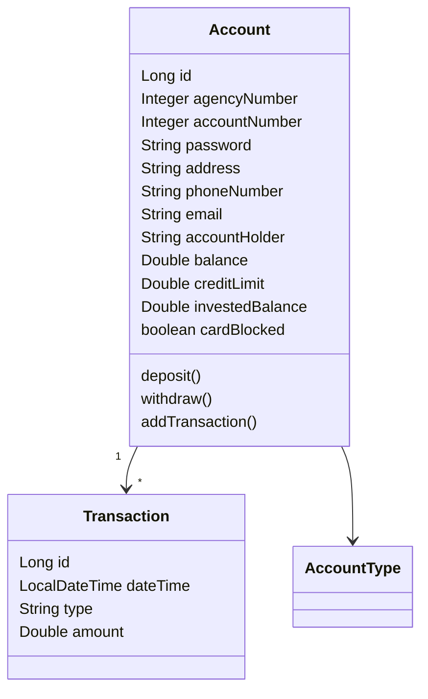
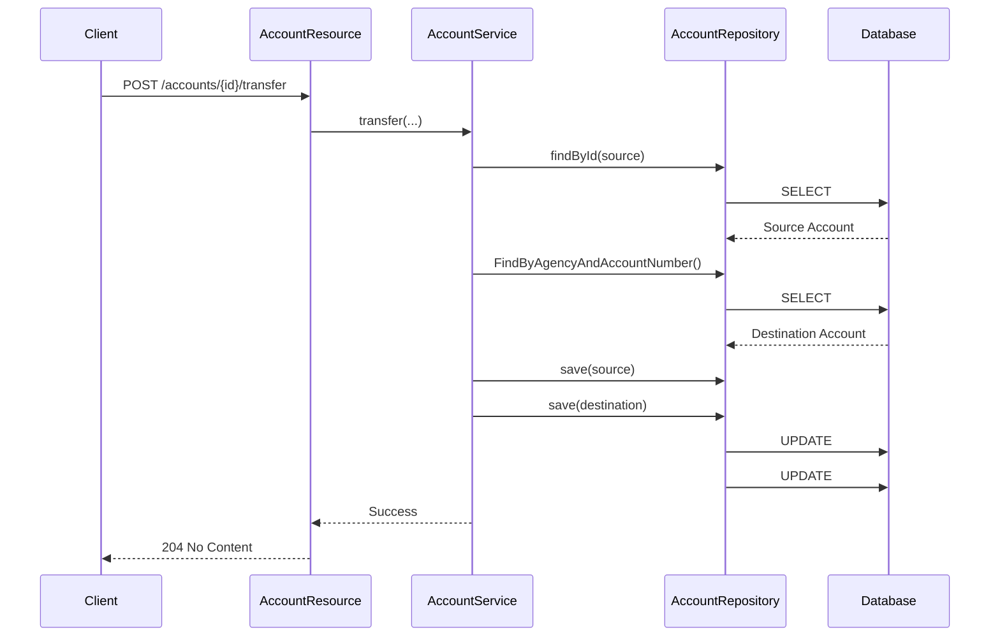

# Digital Bank API

RESTful banking application developed with Spring Boot as part of the **Banking Operations RESTful Accenture Challenge**.

The project provides banking operations through REST endpoints, allowing account management, deposits, withdrawals, transfers, bill payments, investments, loan requests, credit limit requests, transaction history, and customer information updates.

All operations are persisted using **Spring Data JPA** and **H2 Database**, with API documentation available through **OpenAPI / Swagger**.

---

## Repository

GitHub Repository:

[Digital Bank API Repository](https://github.com/ricardobfernandes/bank-challenge-2)

---

## Technologies

- Java 21
- Spring Boot 4.1.1
- Spring Data JPA
- H2 Database
- OpenAPI / Swagger (SpringDoc)
- Maven

---

## Project Structure

```text
src/main/java
│
├── com.ricardo.bankchallenge2
│   ├── Bankchallenge2Application
│
├── config
│   └── TestConfig
│
├── entities
│   ├── Account
│   ├── Transaction
│   └── enums
│       └── AccountType
│
├── repositories
│   ├── AccountRepository
│   └── TransactionRepository
│
├── services
│   ├── AccountService
│   └── exceptions
│
├── resources
│   ├── AccountResource
│   └── exceptions
│       ├── ResourceExceptionHandler
│       └── StandardError
│
└── resources
    ├── application.properties
    └── application-test.properties
```

---

## Features

### Account Management

- Create Account
- Find Account by ID
- List Accounts
- Delete Account

### Banking Operations

- Deposit
- Withdraw
- Transfer
- Request Credit Limit
- Request Loan
- Pay Bill
- Invest Money (CDI simulation)

### Customer Management

- Change Password
- Change Address
- Change Contact Information
- Block Card

### Account Information

- Check Balance
- Check Credit Limit
- Transaction History

### Exception Handling

- Business validation errors
- Account not found errors
- Consistent API error responses

---

## Domain Model

### Account

Represents a bank account and stores:

- Agency Number
- Account Number
- Password
- Address
- Contact Information
- Account Type
- Balance
- Credit Limit
- Invested Balance
- Card Information
- Transaction History

### Transaction

Represents a financial operation executed by an account.

Stores:

- Date and Time
- Transaction Type
- Amount
- Related Account

### AccountType

Enumeration used to identify account categories:

- CHECKING_ACCOUNT
- SAVINGS_ACCOUNT

---

## Class Diagram



---

## Sequence Diagram -Transfer Operation



---

## Running the Application

### Clone Repository

```bash
git clone https://github.com/ricardobfernandes/bank-challenge-2.git
```

### Enter Project Folder

```bash
cd bank-challenge-2
```

### Run Application

Using Maven:

```bash
mvn spring-boot:run
```

Or execute directly through Spring Tool Suite (STS).

The API will be available at:

```text
http://localhost:8080
```

---

## Database (H2)

The project uses an in-memory H2 database.

### H2 Console

```text
http://localhost:8080/h2-console
```

### Connection Settings

```text
JDBC URL: jdbc:h2:mem:testdb
User Name: sa
Password:
```

---

## Initial Text Data

When the application starts using the **test** profile, two accounts are automatically created:
### Checking Account

```text
Agency Number: 1
Account Number: 11111
Account Holder: Joao Silva
Initial Balance: 1000.00
Credit Limit: 500.00
```

### Savings Account

```text
Agency Number: 1
Account Number: 22222
Account Holder: Maria Souza
Initial Balance: 2500.00
```

---

## Swagger Documentation

Swagger UI:

```text
http://localhost:8080/swagger-ui/index.html
```

The API documentation is automatically generated using OpenAPI / Swagger.

---

## API Endpoints

### Accounts

| Method | Endpoint |
|----------|----------|
| GET | /accounts |
| GET | /accounts/{id} |
| POST | /accounts |
| DELETE | /accounts/{id} |

### Banking Operations

| Method | Endpoint |
|----------|----------|
| POST | /accounts/{id}/deposit |
| POST | /accounts/{id}/withdraw |
| POST | /accounts/{id}/transfer |
| POST | /accounts/{id}/request-limit |
| POST | /accounts/{id}/request-loan |
| POST | /accounts/{id}/pay-bill |
| POST | /accounts/{id}/invest |

### Customer Operations

| Method | Endpoint |
|----------|----------|
| POST | /accounts/{id}/change-password |
| POST | /accounts/{id}/change-address |
| POST | /accounts/{id}/change-contact |
| POST | /accounts/{id}/block-card |

### Account Information

| Method | Endpoint |
|----------|----------|
| GET | /accounts/{id}/balance |
| GET | /accounts/{id}/limit |
| GET | /accounts/{id}/transactions |

---

## Error Handling

The application uses a centralized exception handling layer.

Examples:

### 400 Bad Request

```json
{
  "timestamp": "2026-09-04T16:02:46Z",
  "status": 400,
  "error": "Business exception",
  "message": "Deposit amount must be greater than zero.",
  "path": "/accounts/1/deposit"
}
```

### 404 Not Found

```json
{
  "timestamp": "2026-09-04T16:02:46Z",
  "status": 404,
  "error": "Account not found",
  "message": "Account not found!",
  "path": "/accounts/999999"
}
```

---

## Security Considerations

Sensitive fields such as:

- Password
- Card CVV

are hidden from API responses using Jackson serialization controls.

---

## Author

Ricardo Fernandes

Product Engineering Analyst

GitHub: https://github.com/ricardobfernandes